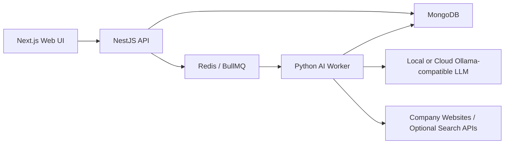

# AVA

AVA is a human-in-the-loop AI lead research agent. It imports a company list, researches public sources, extracts evidence-backed qualification signals, scores company fit, discovers contacts, and drafts outreach for human review.

AVA is an early open-source MVP. It is designed for local experimentation and architecture feedback, not production deployment.

> Local-only warning: AVA does not include authentication. Do not expose the web app, API, AI worker, MongoDB, or Redis directly to the public internet.

## What AVA Does

- Imports companies from CSV.
- Finds or verifies company websites.
- Crawls public website pages and optional search/provider sources.
- Stores source-backed evidence and structured facts.
- Scores fit against an industry campaign profile.
- Discovers contacts from Apollo when available, then website/contact-page fallbacks.
- Drafts email or LinkedIn-style outreach.
- Requires human review before sending or export.

## What AVA Does Not Do

- It does not send bulk outreach automatically.
- It does not bypass LinkedIn login walls.
- It does not include authentication or multi-tenant production controls.
- It does not guarantee compliance with email, privacy, or platform rules.

## Screenshot

Add a screenshot or GIF here before posting widely:

```text
docs/assets/ava-campaign-flow.gif
```

## Architecture



## Prerequisites

- Node.js 18+
- npm 11+
- Python 3.13+
- Docker Desktop or local MongoDB and Redis
- Ollama or another OpenAI-compatible local/cloud endpoint

Optional provider keys:

- `BRAVE_SEARCH_API_KEY` for free search-enrichment testing.
- `LINKEDIN_PUBLIC_SCRAPER_ENABLED=true` for public LinkedIn page fallback.
- Apollo is optional and may require a paid API plan.

## Five-Minute Quick Start

1. Install dependencies.

```bash
npm install
```

2. Start MongoDB and Redis.

```bash
docker compose up -d
```

3. Copy environment files.

```bash
cp apps/api/.env.example apps/api/.env
cp apps/web/.env.example apps/web/.env.local
cp apps/ai-worker/.env.example apps/ai-worker/.env
```

4. Start the services in separate terminals.

```bash
npm run dev -w api
npm run dev -w web
npm run dev -w ai-worker
```

5. Open the web UI.

```text
http://localhost:3100
```

6. Create a campaign and import `sample_companies.csv`.

## Ports

- Web app: `http://localhost:3100`
- API: `http://localhost:3101`
- AI worker health: `http://localhost:8099/health`
- MongoDB: `127.0.0.1:27017`
- Redis: `127.0.0.1:6379`

## Example CSV

Use synthetic examples for demos and tests:

```csv
company_name,website,linkedin_url,linkedin_organization_id,notes
VectorBridge Safety Labs,https://example.com,,,"Synthetic automotive safety consultancy example"
Northstar Embedded Tools,https://example.org,,,"Synthetic embedded validation tools provider"
Harbor Coffee Group,https://example.net,,,"Synthetic non-fit food service example"
```

Bring your own lead list for real use. Do not commit private prospect data.

## Provider Setup

For free testing, start with local crawling and Brave Search:

```env
BRAVE_SEARCH_API_KEY=your_free_testing_key
LINKEDIN_PUBLIC_SCRAPER_ENABLED=true
```

Keep Apollo unset unless you have API access:

```env
# APOLLO_API_KEY=
```

LLM request logs are disabled/redacted by default for public-release safety. Opt in only for local debugging:

```env
LLM_LOG_ENABLED=true
LLM_LOG_REDACT=true
```

## Privacy And Safety Defaults

- AVA stores company evidence, contacts, prompts, and drafts locally.
- Logs redact secrets and avoid full API request bodies by default.
- LLM prompt/response logging is disabled by default.
- The crawler blocks localhost, private IPs, link-local ranges, metadata services, unsafe schemes, and unsafe redirects.
- MongoDB and Redis are bound to localhost in `docker-compose.yml`.

## Common Workflow

1. Configure your product profile.
2. Create a campaign using an industry preset.
3. Import companies from CSV.
4. Find or verify websites.
5. Run research.
6. Review score, facts, source coverage, contacts, oversight, and draft.
7. Edit and approve drafts.
8. Export approved drafts or send manually.

## Troubleshooting

- **Only homepage evidence appears:** configure `BRAVE_SEARCH_API_KEY` or add typed discovery sources such as `website:`, `search:`, and `jobs:`.
- **Apollo returns 403:** your Apollo plan likely does not include people search API access. Leave Apollo unset and use fallback discovery.
- **No draft appears:** check the draft-block reason on the company page. AVA does not draft by default below the score threshold.
- **LLM calls fail:** confirm Ollama is running and `OLLAMA_BASE_URL` points to it.

## Release Status

AVA is released as an early MVP seeking contributors and architecture feedback. Treat it as local-development software until authentication, deployment hardening, and compliance review are added.

## Contributing

See [CONTRIBUTING.md](CONTRIBUTING.md).

## Security

See [SECURITY.md](SECURITY.md).

## Licence

MIT. See [LICENSE](LICENSE).
